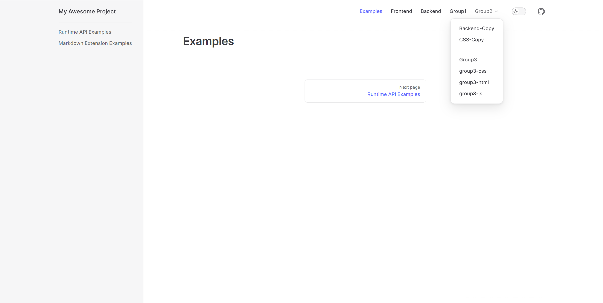

# vitepress-plugin-helper


一个 VitePress 插件，可以通过特定目录结构自动生成 `nav` 和 `sidebar`，并监听 `MarkDown` 文件更改自动重新生成菜单。通过 `fast-glob` 实现。


## 安装

```shell
npm install vitepress-plugin-helper -D
```

## 用法

```ts
import { DefaultTheme, defineConfig } from 'vitepress'
import { vitePressHelperPlugin } from 'vitepress-plugin-helper'
import { getNav, getSidebar } from './menu'


export default defineConfig({
  title: 'My Awesome Project',
  description: 'A VitePress Site',
  themeConfig: {
    nav: getNav(),
    
    sidebar: getSidebar(),
    
    socialLinks: [
      { icon: 'github', link: 'https://github.com/vuejs/vitepress' },
    ],
  },
  vite: {
    plugins: [
      vitePressHelperPlugin(),
    ],
  },
})
```

## 工作原理


* 插件通过扫描 [根目录](https://vitepress.dev/zh/guide/routing#root-and-source-directory) 下的文件结构生成 `nav` 和 `sidebar`，
`nav` 的生成依赖于子目录的 `index.md(targetMDFile)`,
`sidebar` 的生成可以不提供 `index.md(targetMDFile)`，但可以通过该文件自定义显示。

* `.vitepress/cache/plugin_helper_trigger.md` 是服务启动时是否需要生成菜单的判断依据，删除后可以触发生成菜单。


### nav 辅助生成


可以在 `MarkDown` 文件中提供以下内容：修改标题（title）、排序（order）、是否有侧边栏（sidebar）、是否忽略（ignore）和分组（group）导航栏

```md
---
title: Title
order: 1
ignore: false
sidebar: true
group: true
---
```

### sidebar 辅助生成


可以在 `MarkDown` 文件中提供以下内容：修改分组标题（title）、排序（order）、是否折叠（collapsed）和是否忽略（ignore）侧边栏

```md
---
title: Title
order: 1
ignore: false // 高优先级
// targetMDFile
collapsed: false
link: false
---
```

查看示例：[配置在docs](https://github.com/peiyanlu/vitepress-helper/tree/dev/packages/example)，[配置在根目录](https://github.com/peiyanlu/vitepress-helper/tree/dev/packages/example-root)，[指定源目录](https://github.com/peiyanlu/vitepress-helper/tree/dev/packages/example-src)


## 预览


